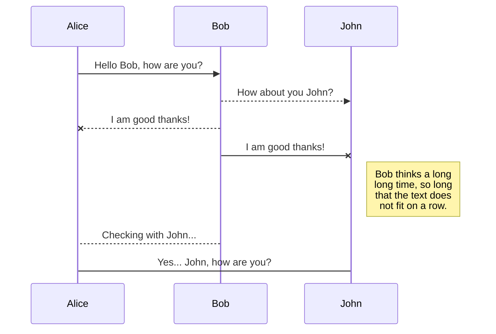
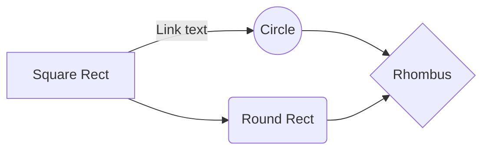

# Welcome to Structure Mobile!

Hi! If you need any help to organize the tasks on your projects, you can use :  **Structure !**
You can create a projet, and assign tickets to the members of the project.

# Project status

*This project is currently in development* 👨‍💻👩‍💻

## Pre-requisites
### In order to make this application work, you need to connect it to a database.
 1. Clone the backend repository project from [Structure's web application](https://github.com/WildCodeSchool/2203-wns-etchebest-tfs-back.git)
 2. At the root of the directory, where the docker-compose.yml file is located, start the application:
- for the first time using the command `docker compose -f docker-compose.yml up --build` 
- if you've already built the application image you can use `docker compose up`

## Start the mobile application

 1. Clone the repository [Structure Mobile](https://github.com/WildCodeSchool/structure-mobile.git)
 2. Install expo `expo install`
 3. Install yarn `yarn install`
 4. Start the app 🚀  `expo start`

## UML diagrams

You can render UML diagrams using [Mermaid](https://mermaidjs.github.io/). For example, this will produce a sequence diagram:

And this will produce a flow chart:

